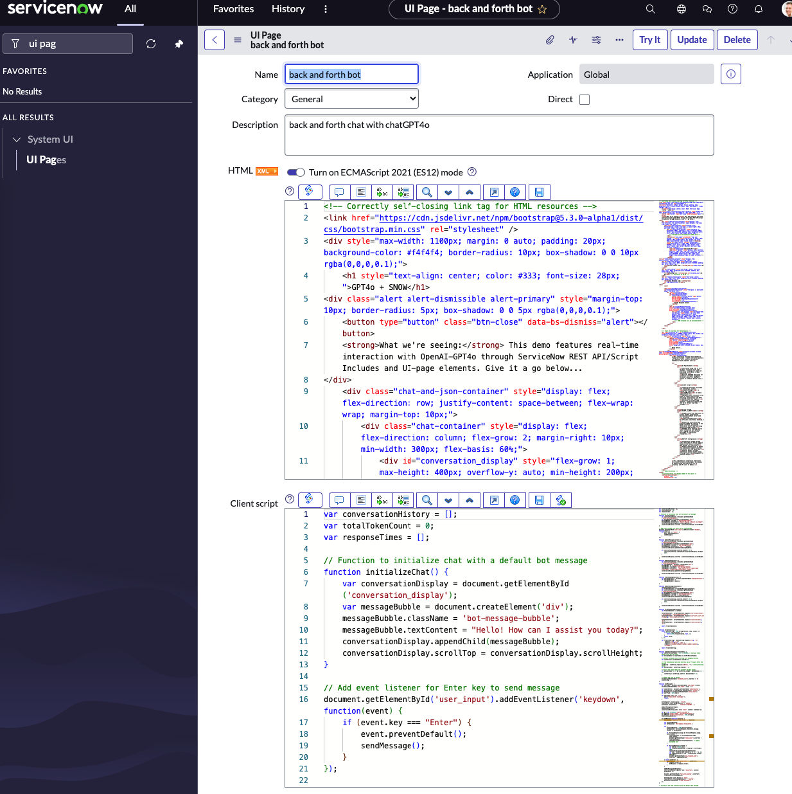
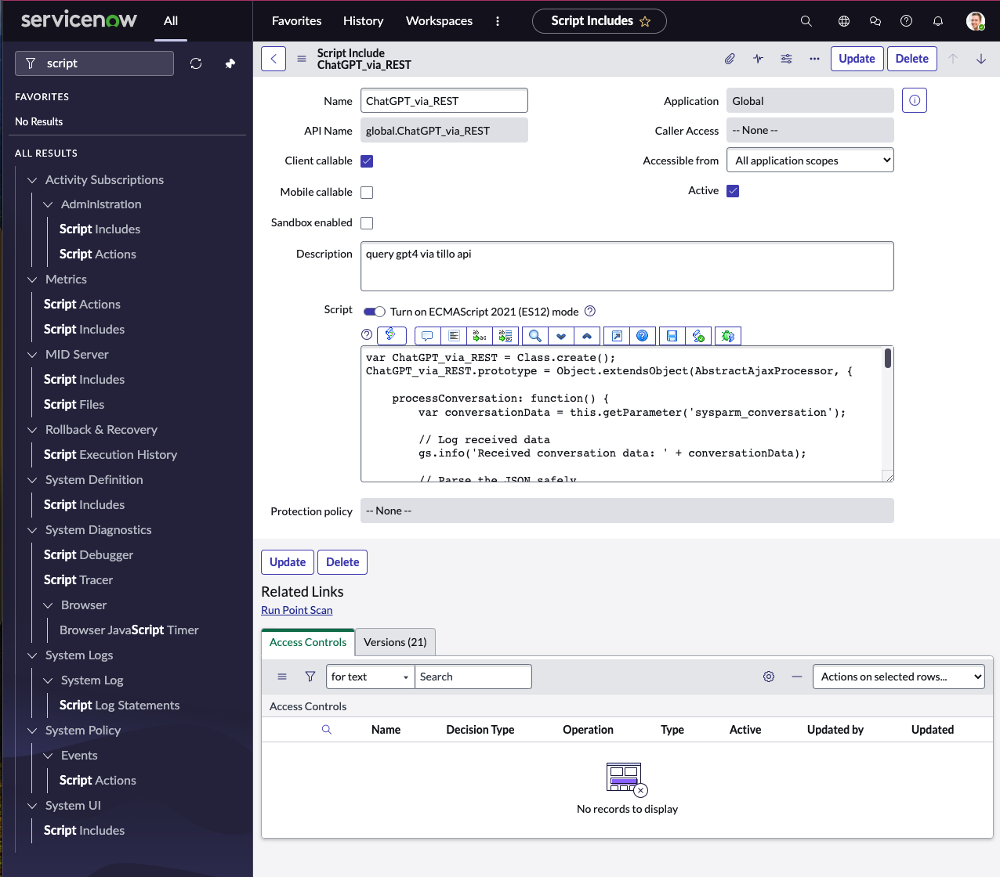
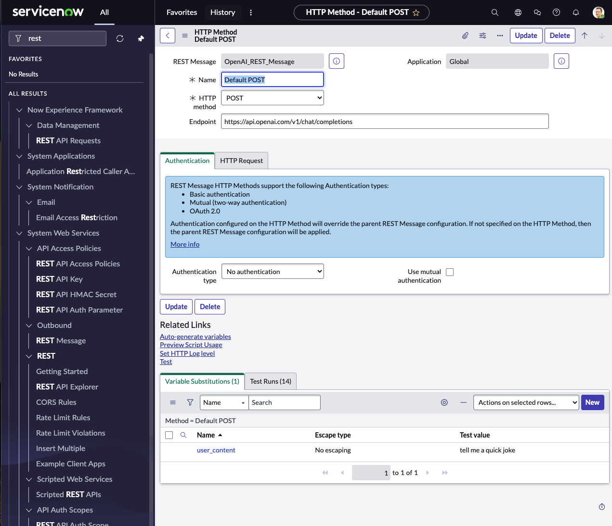
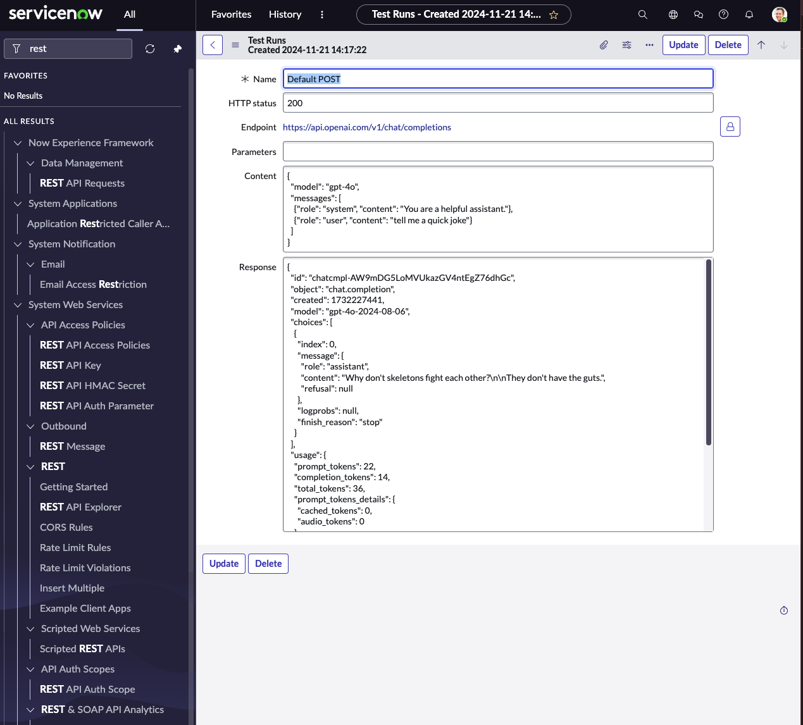
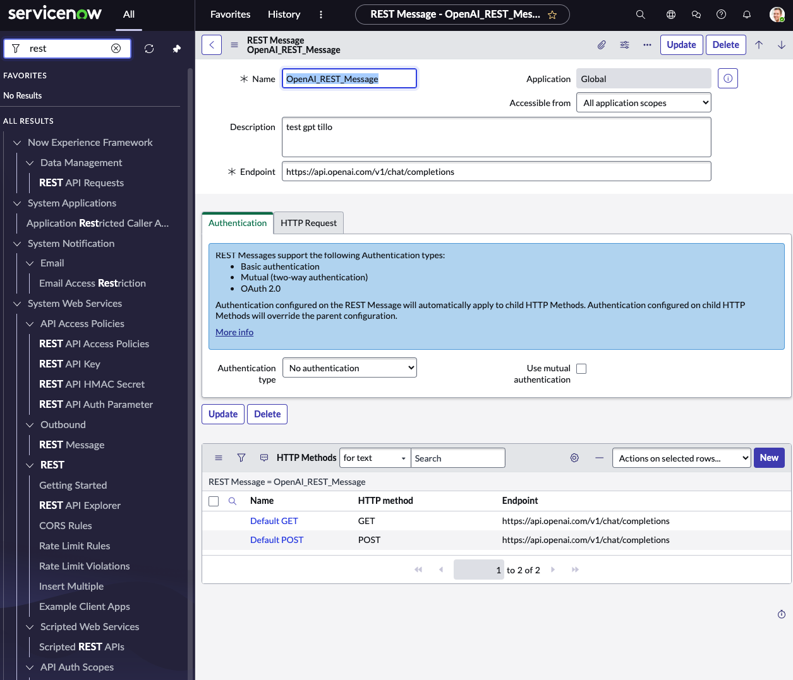

# GPT4o + SNOW Integration

## Overview

This repository demonstrates the integration of ServiceNow with OpenAI's GPT-4 model. The setup involves client scripts within a web interface, a server-side script for processing conversation data, and a REST configuration within ServiceNow's system to communicate seamlessly with OpenAI's API.

## File Structure

- **client_script.js**: Handles the user interface and communication with the backend.
- **html.html**: Provides the structural foundation of the chat interface.
- **script_includes.js**: Manages server-side processing of conversation data with OpenAI.

## Setup Instructions

### Prerequisites

- Access to a ServiceNow instance.
- A valid OpenAI API key to access GPT-4 via REST.

### Step-by-Step Instructions

#### 1. HTML Interface Setup

- Create a new UI Page in ServiceNow.
- Paste the content of `html.html` into the HTML field of the UI Page.

#### 2. Client Script Setup

- Add a Dynamic HTML script that loads `client_script.js`.
- Ensure that the script is referenced on the UI Page created above.

#### 3. Script Include Setup

- Create a new Script Include in ServiceNow.
- Set the Name to `ChatGPT_via_REST` and ensure it is set to "Client Callable" if necessary.
- Paste the content of `script_includes.js` into the Script field.

#### 4. REST Integration Setup

- Create a new REST Message in ServiceNow:
  - Set Name to `Openai_REST_Message`.
  - Under the HTTP methods, create a method named `Default POST`.
  - Paste the endpoint URL: `https://api.openai.com/v1/chat/completions`.
  - Configure the REST message as shown in the screenshots below.

##### REST Configuration Screenshots

Ensure that the REST configuration matches the following:

- In the REST Message, add necessary headers for authentication, ensuring your OpenAI API key is securely included in the authorization header.

#### 5. Testing the Integration

- Navigate to the UI page created in the first step.
- Interact with the chat interface and monitor ServiceNow logs for any errors or successful API interactions.

## Images

For visual guidance, refer to the screenshots located in the `/screenshots/` directory:

1. `ui_page.png` - UI Page setup for the chat interface.
2. `script_include.png` - Script Include setup for processing conversations.
3. `rest1.png` - Basic REST configuration.
4. `rest2.png` - REST method details.
5. `rest3.png` - Completed REST message setup.

These images demonstrate the configuration of various components necessary for the integration within ServiceNow and OpenAI.

## Conclusion

Once set up as per these instructions, you will have a functioning chat interface in your ServiceNow environment that interacts with GPT-4 via REST APIs. This setup showcases how ServiceNow's UI and script ecosystem can be extended to facilitate conversational AI interactions seamlessly.
